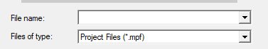
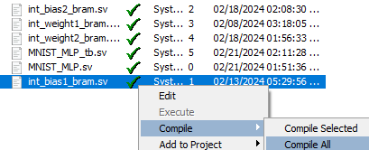
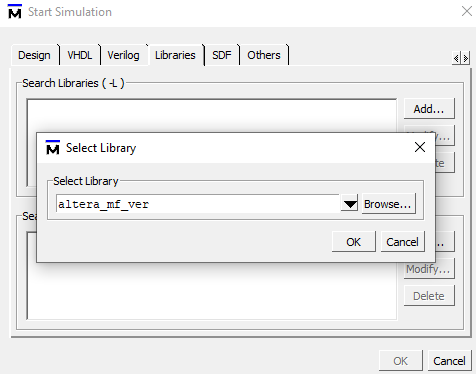
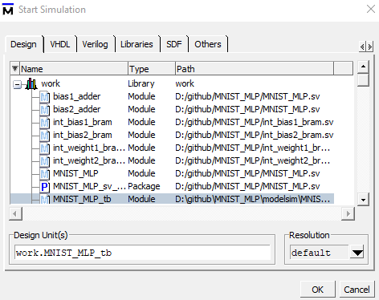
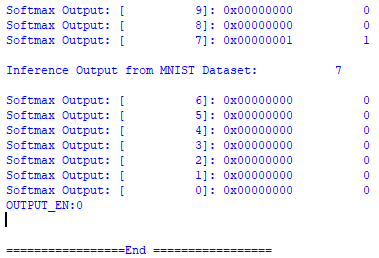

# Ultra simple MNIST Inference in FPGA 
- Input Layer: 28*28 = 784
- Hidden Layer: 32 (ReLu) 
- Output Layer: 10 (Softmax)  

## Python Training 
- Numpy Training. Only the dataset is loaded from Tensorflow Library 
- Float Parameter -> Integer -> 4-digit Hex (16 bit) -> SystemVerilog Memory Format
- int_bias1_bram.sv
- int_bias2_bram.sv
- int_weight1_bram.sv
- int_weight2_bram.sv


## How to run testbench 
1. Open Modelsim 
2. File -> Open -> Go to Modelsim dir -> Select File of type: Project Files (*.mpf)

3. Select MNIST_MLP_tb 
4. Right click one of the file -> Compile All

5. Simulate -> Start Simulation  
6. Go to Libraries 
7. Add "altera_mf_ver" -> required for ROM and RAM module 

8. Go to Design -> Work -> Select Testbench (MNIST_MLP_tb). The Simulation with waveform will pop up.

9. Type following command in the terminal. It will add all variables to testbench
```
add wave sim:/MNIST_MLP_tb/* 
```
10. Run simulation 
```
run 18000
```

![alt text][img/image-5.png]

## Modifying Data Input 
Change the mnist_hex.txt values. It contains the first image of mnist test dataset in hexadecimal format. 

