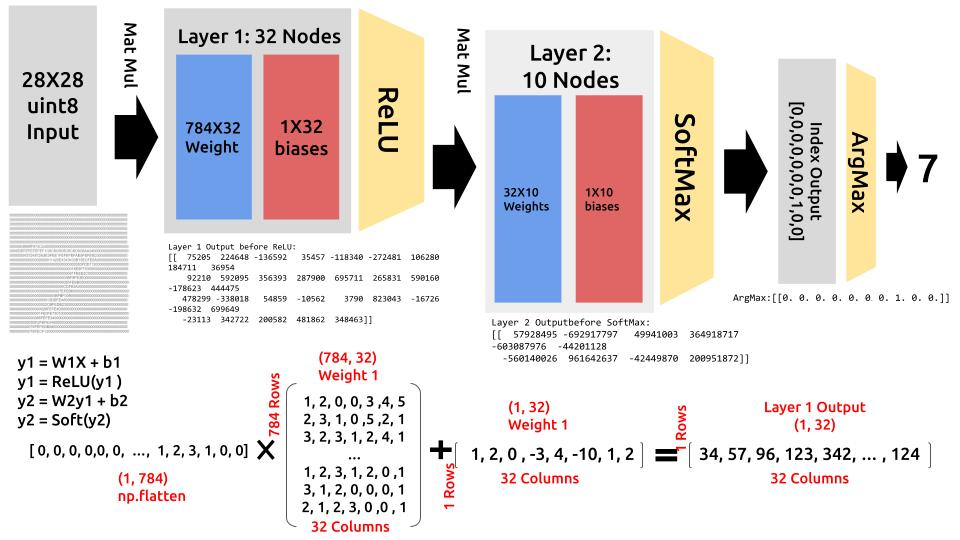

# Simplest MNIST MLP implementation in DE-10 Standard Board 

## Modelsim output 

## Quartus && Modelsim Installation 
- go to https://jin-gitbook.gitbook.io/engineering-101/fpga-de10-standard-board-setup
